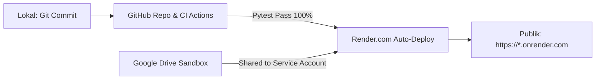

# 🚀 Panduan Eksekusi Deployment Cloud (Render.com) & CI/CD
## Web Server GRAIN Sandbox Data Catalog

Panduan ini berisi checklist langkah demi langkah (*Manual-In-The-Middle / MITM*) untuk mempublikasikan Web Server GRAIN Sandbox Data Catalog dari repositori lokal ke **GitHub** dan **Render.com** (Cloud Web Service).

---

## 📋 Ringkasan Alur Kerja



---

## 🛠️ Prasyarat (Prerequisites)

1. Akun **[GitHub](https://github.com/)** aktif.
2. Akun **[Render.com](https://render.com/)** aktif (gratis / Free tier).
3. File `credentials.json` Google Service Account sudah ada di folder server lokal.
4. Folder Google Drive berisi data eksperimen GRAIN Sandbox telah disiapkan.

---

## 📌 Checklist Langkah Deployment

### 1️⃣ Fase 1: Push Repositori ke GitHub

1. **Buka GitHub di Browser**:
   - Masuk ke akun GitHub Anda.
   - Klik tombol **New repository** (atau akses [github.com/new](https://github.com/new)).
   - Beri nama repository, misalnya: `grain-sandbox-server` (atau `grain-data-catalog`).
   - Pilih visibilitas **Private** (disarankan) atau **Public**.
   - **Jangan** centang *"Add a README file"*, *"Add .gitignore"*, atau *"Choose a license"* karena file sudah ada di lokal.
   - Klik **Create repository**.

2. **Hubungkan & Push dari Terminal Lokal**:
   Jalankan perintah berikut di folder `c:\TERR\4. WORK\6. Server GRAIN`:

   ```bash
   # Tambahkan semua file baru ke git
   git add .

   # Commit perubahan
   git commit -m "feat: setup CI/CD GitHub Actions and cloud deployment config"

   # Hubungkan ke remote repository GitHub Anda (ganti USERNAME dan REPO_NAME)
   git remote add origin https://github.com/USERNAME/grain-sandbox-server.git

   # Pastikan branch bernama main
   git branch -M main

   # Push ke GitHub
   git push -u origin main
   ```

3. **Verifikasi GitHub Actions CI**:
   - Buka tab **Actions** di repositori GitHub Anda.
   - Periksa workflow **"Test Suite (Pytest)"**.
   - Pastikan status workflow selesai dengan centang hijau (**Passed** - 24 tests passed).

---

### 2️⃣ Fase 2: Ekstraksi Kredensial & Berbagi Google Drive

1. **Jalankan Skrip Helper Lokal**:
   Di terminal lokal, jalankan:
   ```bash
   python generate_cloud_env.py
   ```
   *Output akan menampilkan `Client Email` dan otomatis menyalin string raw JSON ke clipboard Anda.*

2. **Bagikan Folder Google Drive**:
   - Buka [Google Drive](https://drive.google.com/) di browser.
   - Cari folder root eksperimen GRAIN Sandbox (folder yang berisi subfolder `1. EXP-...`, dsb).
   - Klik kanan folder > **Share (Bagikan)**.
   - Masukkan `Client Email` dari output di atas (contoh: `grain-catalog-reader@grain-sandbox-server.iam.gserviceaccount.com`).
   - Berikan hak akses **Viewer** (atau **Editor** jika ingin fitur upload).
   - Klik **Send / Bagikan**.

3. **Salin Folder ID Google Drive**:
   - Buka folder tersebut di URL browser:
     `https://drive.google.com/drive/folders/1aBcDeFgHiJkLmNoPqRsTuVwXyZ_12345`
   - Salin kode acak di bagian akhir URL (ini adalah `GDRIVE_ROOT_FOLDER_ID`).

---

### 3️⃣ Fase 3: Deploy Web Service di Render.com

1. **Buka Dashboard Render**:
   - Kunjungi [dashboard.render.com](https://dashboard.render.com/).
   - Klik tombol **New +** di pojok kanan atas > Pilih **Web Service**.

2. **Hubungkan Repositori GitHub**:
   - Pilih opsi **"Build and deploy from a Git repository"**.
   - Hubungkan akun GitHub Anda jika belum terhubung, lalu pilih repositori `grain-sandbox-server`.

3. **Konfigurasi Web Service**:
   Isi formulir pembuatan service dengan parameter berikut:

   | Pengaturan | Nilai Rekomendasi |
   |---|---|
   | **Name** | `grain-sandbox-catalog` (atau sesuai keinginan) |
   | **Region** | `Singapore (Southeast Asia)` *(latency terendah ke Indonesia)* |
   | **Branch** | `main` |
   | **Runtime** | `Python 3` |
   | **Build Command** | `pip install -r requirements.txt` |
   | **Start Command** | `python -m uvicorn app.main:app --host 0.0.0.0 --port $PORT` |
   | **Instance Type** | `Free` |

4. **Konfigurasi Environment Variables**:
   Scroll ke bagian **Environment Variables**, klik **Add Environment Variable**, lalu tambahkan:

   | Key | Value / Keterangan |
   |---|---|
   | `GDRIVE_SERVICE_ACCOUNT_RAW_JSON` | **Paste string JSON 1 baris** yang telah disalin dari `generate_cloud_env.py` |
   | `GDRIVE_ROOT_FOLDER_ID` | **ID Folder Google Drive** yang disalin pada Fase 2 |
   | `ADMIN_PIN` | PIN rahasia untuk sync & admin (contoh: `889900`) |
   | `PORTAL_TITLE` | `GRAIN Sandbox Experiment Data Server` |
   | `PORTAL_SUBTITLE` | `Analog Geological & Tectonic Modeling Video/Photo Catalog` |
   | `PYTHON_VERSION` | `3.12.10` |

5. **Deploy**:
   - Klik tombol **Create Web Service** di bagian bawah.
   - Render akan melakukan proses build dan deploy secara otomatis (~1-2 menit).
   - Tunggu hingga status log menampilkan: `Application startup complete.` dan status service menjadi **Live**.

---

### 4️⃣ Fase 4: Verifikasi & Sinkronisasi Data Awal

1. **Buka URL Aplikasi**:
   - Klik URL publik yang diberikan Render (misal: `https://grain-sandbox-catalog.onrender.com`).
2. **Uji Koneksi & Sinkronisasi**:
   - Buka halaman Admin / Setup di browser:
     `https://grain-sandbox-catalog.onrender.com/setup` (atau klik tombol **Admin Panel** di navbar).
   - Masukkan `ADMIN_PIN` yang telah Anda tentukan.
   - Klik **"Test Connection"** > Pastikan indikator status berwarna hijau (*Google Drive API Connected*).
   - Klik **"Trigger Manual Sync"** untuk memindai seluruh eksperimen dan file dari Google Drive ke katalog SQLite.
3. **Uji Fitur Katalog**:
   - Kembali ke Beranda (`/`).
   - Pastikan daftar eksperimen, video MP4 timelapse, preview foto, dan fitur pencarian berfungsi dengan lancar.

---

## ⚡ Tips & Catatan Penting

> [!TIP]
> **Otomasi CI/CD:** Setiap kali Anda melakukan `git push` perubahan kode ke branch `main`, GitHub Actions akan menguji kode secara otomatis. Jika lulus, Render.com akan otomatis memicu rebuild dan deploy versi terbaru (*Zero Downtime Rolling Deployment*).

> [!NOTE]
> **Free Tier Sleep Behavior (Render):** Pada paket gratis Render, aplikasi akan "tidur" (sleep) jika tidak ada lalu lintas selama 15 menit. Request pertama setelah tidur akan membutuhkan waktu *cold start* sekitar 30-50 detik. Untuk menjaga server tetap aktif (24/7), Anda dapat menggunakan layanan gratis seperti [UptimeRobot](https://uptimerobot.com/) atau [Cron-job.org](https://cron-job.org/) untuk melakukan ping HTTP GET ke URL server setiap 10 menit.

> [!IMPORTANT]
> **Keamanan Kredensial:** Jangan pernah menghapus `credentials.json` atau `.env` dari file `.gitignore`. Environment variable `GDRIVE_SERVICE_ACCOUNT_RAW_JSON` di dashboard Render sudah aman dan terenkripsi.

---

## 🆘 Troubleshooting

| Gejala Masalah | Penyebab | Solusi |
|---|---|---|
| **Error 401 / 403 saat Sync** | Service Account belum memiliki izin akses ke folder Google Drive | Buka Google Drive > Share folder ke `client_email` Service Account sebagai **Viewer**. |
| **Error: Folder ID Not Found** | Nilai `GDRIVE_ROOT_FOLDER_ID` salah atau kosong | Periksa kembali ID folder di URL browser Google Drive dan update di Environment Variables Render. |
| **Invalid JSON Error di Config** | Format `GDRIVE_SERVICE_ACCOUNT_RAW_JSON` terpotong saat copy-paste | Jalankan ulang `python generate_cloud_env.py` dan paste string lengkapnya ke Render Dashboard. |
| **Port Binding Error / Deploy Timeout** | Format start command tidak menggunakan variable `$PORT` | Pastikan Start Command adalah `python -m uvicorn app.main:app --host 0.0.0.0 --port $PORT`. |
