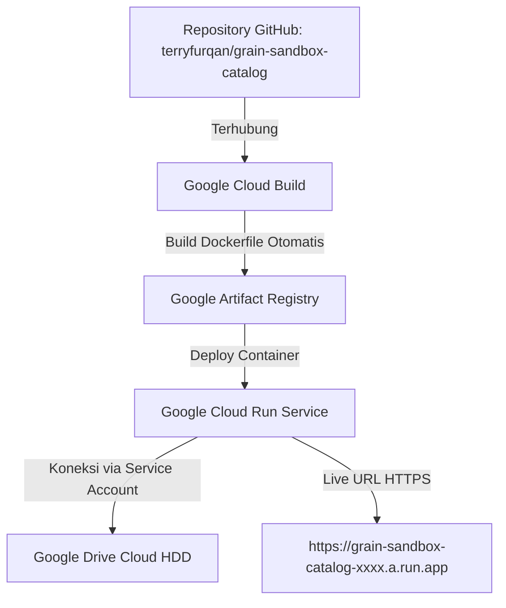

# ☁️ Panduan Deployment ke Google Cloud Run (GCP)
## Web Server GRAIN Sandbox Data Catalog (FastAPI + Docker)

Panduan ini memandu Anda langkah demi langkah untuk mempublikasikan Web Server **GRAIN Sandbox Experiment Data Catalog** ke **Google Cloud Run** (layanan serverless container resmi dari Google Cloud).

---

## 🌟 Mengapa Google Cloud Run?

| Fitur / Parameter | Google Cloud Run (Free Tier) | Hugging Face Spaces |
|---|---|---|
| **Ekosistem & Latensi** | **1 Ekosistem dengan Google Drive** (Google Backbone Network, streaming ultra-cepat) | Terpisah (akses via internet publik) |
| **Batas Gratis (Free Tier)** | **2 Juta Request/Bulan GRATIS** + 360.000 GiB-detik RAM gratis | Gratis 24/7 (2 vCPU, 16 GB RAM) |
| **Scale-to-Zero** | ✅ Ya (Otomatis tidur saat tidak ada request, hemat biaya) | ❌ Selalu menyala (atau sleep mode) |
| **HTTPS & Custom Domain** | ✅ Otomatis dapat URL HTTPS (`*.a.run.app`) + custom domain | ✅ Otomatis dapat URL HTTPS (`*.hf.space`) |
| **Integrasi Service Account** | ✅ Native Google Cloud IAM | Menggunakan Secret String |

---

## 📋 Ringkasan Alur Deployment ke Cloud Run



---

## 🚀 Pilihan 1: Deploy Lewat Web Console Google Cloud (Paling Mudah, Tanpa Install CLI)

Metode ini dilakukan langsung melalui web browser di Google Cloud Console dengan menghubungkan repositori GitHub Anda.

### 1️⃣ Langkah 1: Buka Cloud Run di Google Cloud Console
1. Buka [Google Cloud Console](https://console.cloud.google.com/).
2. Pastikan Anda telah memilih Project GCP Anda (misalnya project tempat Service Account Google Drive dibuat).
3. Di bilah pencarian atas, ketik **Cloud Run** atau buka langsung: **[console.cloud.google.com/run](https://console.cloud.google.com/run)**.
4. Klik tombol **+ CREATE SERVICE** (Buat Layanan).

---

### 2️⃣ Langkah 2: Hubungkan Repositori GitHub
1. Pada pilihan *Deployment platform*, pilih:
   - **Continuously deploy from a repository** (Deploy berkelanjutan dari repositori).
2. Klik tombol **SET UP WITH CLOUD BUILD**.
3. Pilih penyedia Git: **GitHub**.
4. Berikan otorisasi akun GitHub Anda dan pilih repositori:
   - **Repository**: `terryfurqan/grain-sandbox-catalog` (atau akun/repo Anda).
5. Pada *Branch*, pilih: `^main$`.
6. Pada *Build Type*, pilih: **Dockerfile** (lokasi: `/Dockerfile`).
7. Klik **Save**.

---

### 3️⃣ Langkah 3: Konfigurasi Service Cloud Run
1. **Service name**: `grain-sandbox-catalog` (atau nama pilihan Anda).
2. **Region**: Pilih region terdekat, misalnya:
   - `asia-southeast1` (Singapura) — *Sangat direkomendasikan untuk Indonesia*
   - `asia-southeast2` (Jakarta)
3. **Authentication**:
   - Pilih **Allow unauthenticated invocations** (agar web portal dapat dibuka oleh tim/publik tanpa login akun IAM GCP).
4. **CPU allocation and pricing**:
   - Pilih **CPU is only allocated during request processing** (Sangat hemat / masuk Free Tier).

---

### 4️⃣ Langkah 4: Tambahkan Environment Variables
1. Buka menu akordeon **Container, Volumes, Networking, Security** di bagian bawah.
2. Di tab **Container**, buka sub-bagian **Variables & Secrets**.
3. Klik **+ ADD VARIABLE** dan masukkan variabel berikut:

| Name | Value | Keterangan |
|---|---|---|
| `GDRIVE_ROOT_FOLDER_ID` | *(Folder ID Google Drive Anda)* | ID folder data sandbox dari URL Google Drive |
| `ADMIN_PIN` | `123456` | PIN admin untuk akses `/setup` & refresh index |
| `PORTAL_TITLE` | `GRAIN Sandbox Experiment Data Server` | Judul portal |
| `PORTAL_SUBTITLE` | `Analog Geological & Tectonic Modeling Video/Photo Catalog` | Subjudul portal |
| `GDRIVE_SERVICE_ACCOUNT_RAW_JSON` | *(String JSON dari credentials.json)* | Salin dari output `python generate_cloud_env.py` |

> 💡 **Cara Cepat Menyalin `GDRIVE_SERVICE_ACCOUNT_RAW_JSON`**:
> Jalankan perintah berikut di terminal komputer lokal Anda:
> ```bash
> python generate_cloud_env.py
> ```
> String JSON kredensial otomatis disalin ke clipboard Anda! Tinggal tekan `Ctrl+V` di kolom Value.

4. Klik **CREATE**.
5. Tunggu 1–2 menit hingga proses build dan deployment selesai. Google Cloud Run akan memberikan URL publik HTTPS Anda (misal: `https://grain-sandbox-catalog-xxxxxxxx-as.a.run.app`).

---

## ⚡ Pilihan 2: Deploy Cepat via Google Cloud Shell (1 Perintah)

Jika Anda ingin deploy instan dalam 1 perintah tanpa instalasi apapun di PC lokal:

1. Buka Google Cloud Console dan klik ikon **Cloud Shell** (ikon `>_` di pojok kanan atas browser).
2. Di dalam terminal Cloud Shell, jalankan:
   ```bash
   git clone https://github.com/terryfurqan/grain-sandbox-catalog.git
   cd grain-sandbox-catalog
   ```
3. Deploy langsung ke Cloud Run dengan perintah berikut:
   ```bash
   gcloud run deploy grain-sandbox-catalog \
     --source . \
     --region asia-southeast1 \
     --allow-unauthenticated \
     --set-env-vars GDRIVE_ROOT_FOLDER_ID="YOUR_FOLDER_ID",ADMIN_PIN="123456"
   ```
4. Masukkan string kredensial service account bila diminta, atau atur via Secret Manager.

---

## 🔒 Konfigurasi Izin Google Drive

Pastikan Service Account Anda telah diberi izin akses ke Folder Google Drive:
1. Buka [Google Drive](https://drive.google.com/).
2. Klik kanan folder data eksperimen sandbox -> **Share** (Bagikan).
3. Masukkan email Service Account:
   `grain-catalog-reader@grain-sandbox-server.iam.gserviceaccount.com` (atau email service account GCP Anda).
4. Berikan role **Viewer** (atau **Editor** jika ingin izin penuh).
5. Klik **Send** / **Save**.

---

## 🎯 Mengakses Web Server yang Telah Berjalan

Setelah deployment selesai:
1. Buka URL HTTPS yang diberikan oleh Cloud Run di browser.
2. Akses halaman wizard setup untuk validasi pertama kali di:
   `https://<url-cloud-run-anda>/setup`
3. Masukkan Admin PIN (`123456`) untuk memeriksa status koneksi Google Drive dan melakukan sinkronisasi awal metadata katalog (`catalog.db`).
