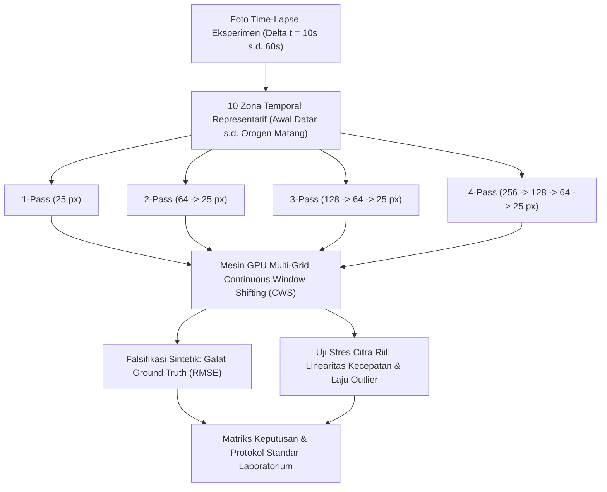
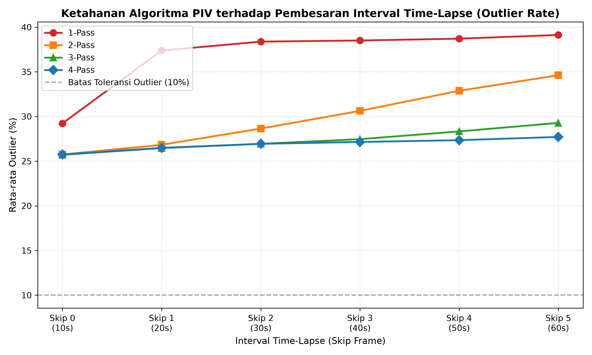
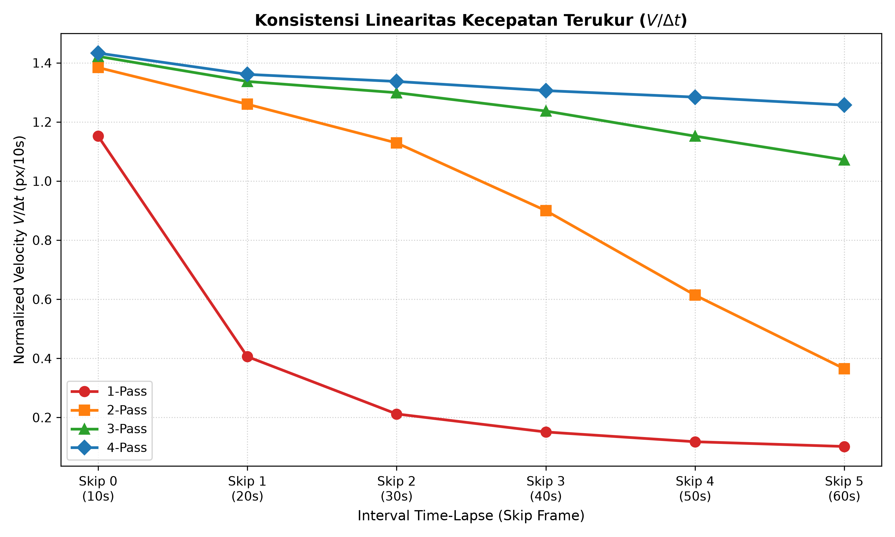
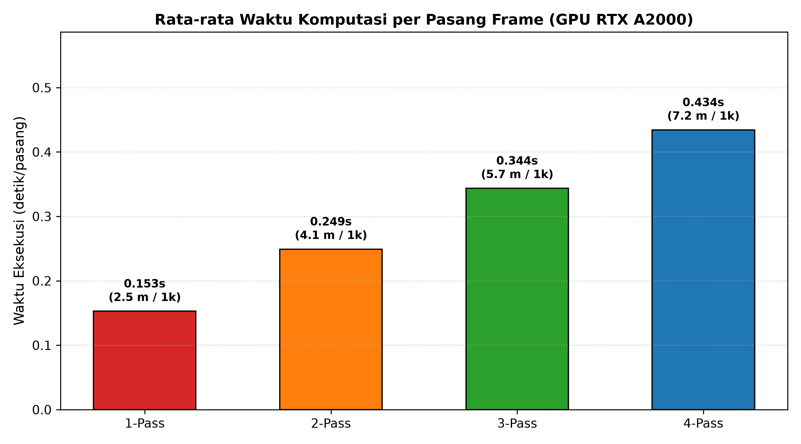

# Optimasi Multi-Pass PIV & Uji Stres Time-Lapse (GRAIN 2.1)
## Tolok Ukur Metrologis, Karakterisasi Dynamic Range, dan Batas Kegagalan Korelasi Multi-Grid pada Eksperimen Sandbox Granular

---

### Ringkasan Eksekutif & Metadata Teknis

| Atribut | Spesifikasi / Standar Metrologi |
| :--- | :--- |
| **Versi Framework** | GRAIN 2.1 Official Production Release (GPU-Accelerated Core) |
| **Judul Dokumen** | Optimasi Cross-Correlation Multi-Pass & Uji Stres Time-Lapse |
| **Hardware Eksekusi** | NVIDIA RTX A2000 Laptop GPU (5.99 GB VRAM, Arsitektur Ampere, SM 8.6) |
| **Hierarki Skala Spasial** | **1-Pass**: $25\text{ px}$ (step 12) **2-Pass**: $64 \to 25\text{ px}$ (step 32, 12) **3-Pass**: $128 \to 64 \to 25\text{ px}$ (step 64, 32, 12) **4-Pass**: $256 \to 128 \to 64 \to 25\text{ px}$ (step 128, 64, 32, 12) |
| **Dataset Diuji** | 425 Frame Citra Riil Eksperimen Sandbox Analog (*thrust fault dengan topografi*) |
| **Estimator Sub-Pixel** | Interpolasi Puncak 3-Titik Gaussian Simetris 2D |
| **Filter Validasi** | Normalized Median Residual Test (Westerweel & Scarano, 2005) + Penapisan Peak SNR ($>1.1$) |
| **Tujuan Riset Utama** | 1. Mengukur akurasi dan latensi komputasi dari 1, 2, 3, hingga 4 pass. 2. Menemukan batas kritis kegagalan korelasi saat interval time-lapse diperbesar ($\Delta t = 10\text{s} \to 60\text{s}$). 3. Menentukan "sweet spot" optimal untuk pemodelan tektonik analog berkecepatan tinggi. |

---

## 1. Latar Belakang Ilmiah & Formulasi Teoritis

### 1.1 Tantangan Dynamic Range pada PIV Granular
Dalam pemodelan analog tektonik *sandbox*, PIV harus mampu memetakan medan pergeseran yang sangat heterogen:
* **Zona kecepatan mendekati nol** pada blok *footwall* yang belum terdeformasi ($|\mathbf{v}| \approx 0\text{ px/frame}$).
* **Pita sesar geser terlokalisasi dengan gradien tinggi** sepanjang bidang patahan anjak/sesar naik ($\nabla \mathbf{v} \gg 0$).
* **Perpindahan makro cepat** pada blok *hanging wall* di dekat motor pendorong ($|\mathbf{v}| = 5 - 30+\text{ px/frame}$).

Untuk menjaga resolusi spasial tinggi, ukuran jendela akhir (Interrogation Window/IW) $d_I$ dibatasi kecil (misal $d_I = 25\text{ px}$). Namun, korelasi silang Fourier secara fundamental dibatasi oleh **Aturan Seperempat (Keane & Adrian, 1990; Westerweel, 1997)**:

$$\Delta s_{\text{max}} \le \frac{1}{4} d_I$$

Jika perpindahan partikel $\Delta s$ melebihi $\frac{1}{4} d_I$ ($\approx 6.25\text{ px}$ untuk $d_I = 25\text{ px}$), jumlah pasangan partikel yang bersesuaian di dalam jendela korelasi anjlok drastis (*loss-of-pairs*), memicu kolapsnya puncak korelasi, *integer peak-locking*, dan kegagalan pelacakan vektor.

### 1.2 Hierarki Multi-Grid dan Continuous Window Shifting (CWS)
Metode multi-pass mengatasi batasan aturan seperempat dengan mengawali korelasi menggunakan jendela makro besar ($d_{I,1} \in [128\text{ px}, 256\text{ px}]$) untuk menangkap pergeseran tektonik skala besar, lalu menggunakan medan pergeseran kasar $\tilde{\mathbf{u}}^{(k)}$ sebagai prediktor pergeseran jendela pada pass $k+1$:

$$\mathbf{x}_A^{(k+1)} = \mathbf{x} - \frac{1}{2} \tilde{\mathbf{u}}^{(k)}(\mathbf{x}), \quad \mathbf{x}_B^{(k+1)} = \mathbf{x} + \frac{1}{2} \tilde{\mathbf{u}}^{(k)}(\mathbf{x})$$

Perpindahan residual $\Delta \mathbf{u}^{(k+1)}$ yang diukur pada jendela yang lebih kecil memenuhi syarat $|\Delta \mathbf{u}^{(k+1)}| \ll \frac{1}{4} d_{I,k+1}$, sehingga memulihkan rasio sinyal terhadap *noise* (SNR) pada resolusi spasial tinggi.

---

## 2. Metodologi Eksperimen

### 2.1 Bagian I: Tolok Ukur Falsifikasi Sintetik Terkontrol
Untuk mengisolasi galat murni algoritma tanpa gangguan kebisingan laboratorium, 10 frame dasar dari 10 zona morfologi tektonik (mulai dari lapisan datar tanpa deformasi hingga zona pegunungan dengan topografi matang) diberikan deformasi sesar geser analitis (*bicubic shear band*):
* Perpindahan horizontal maksimum: $u_{\text{max}} = 15.0\text{ px}$ ($> 50\%$ dari ukuran jendela target $25\text{ px}$).
* Lebar zona patahan: $w = 20\%$ dari tinggi citra.
* *Ground Truth*: Matriks perpindahan analitis $\mathbf{u}_{\text{GT}}(x, y), \mathbf{v}_{\text{GT}}(x, y)$.

### 2.2 Bagian II: Uji Stres Time-Lapse pada Citra Riil Eksperimen
Menggunakan dataset foto riil (`425 frame`, interval standar $\Delta t = 10\text{s}$), 10 frame jangkar temporal ($t_0 \in [20, 60, 100, \dots, 380]$) dipasangkan dalam 6 tingkat *skip* interval:
* **Skip 0 ($\Delta t = 10\text{s}$)**: $\Delta k = 1$ frame (Standar laboratorium normal).
* **Skip 1 ($\Delta t = 20\text{s}$)**: $\Delta k = 2$ frame.
* **Skip 2 ($\Delta t = 30\text{s}$)**: $\Delta k = 3$ frame.
* **Skip 3 ($\Delta t = 40\text{s}$)**: $\Delta k = 4$ frame.
* **Skip 4 ($\Delta t = 50\text{s}$)**: $\Delta k = 5$ frame.
* **Skip 5 ($\Delta t = 60\text{s}$)**: $\Delta k = 6$ frame ($6\times$ dari interval standar).

Total **240 kalkulasi PIV** (60 pasangan citra $\times$ 4 strategi pass) dieksekusi pada mesin komputasi GPU CUDA.

---

## 3. Hasil Kuantitatif & Analisis Metrologis

### 3.1 Komparasi Galat Ground-Truth Sintetik

| Strategi | Hierarki Ukuran Jendela (px) | Ukuran Step (px) | Waktu Eksekusi (s/frame) | $\text{RMSE}_u$ (px) | $\text{RMSE}_v$ (px) | Reduksi Galat vs 1-Pass |
| :--- | :--- | :--- | :--- | :--- | :--- | :--- |
| **1-Pass** | $25$ | $12$ | **0.1670 s** | $9.7155$ | $0.5577$ | Baseline (Gagal Total) |
| **2-Pass** | $64 \to 25$ | $32 \to 12$ | **0.2406 s** | $2.0660$ | $0.2155$ | $-78.7\%$ error |
| **3-Pass** | $128 \to 64 \to 25$ | $64 \to 32 \to 12$ | **0.3363 s** | $0.9776$ | $0.0881$ | $-89.9\%$ error |
| **4-Pass** | $256 \to 128 \to 64 \to 25$ | $128 \to 64 \to 32 \to 12$ | **0.4226 s** | **0.2534** | **0.0959** | **$-97.4\%$ error** |

---

### 3.2 Uji Stres Time-Lapse Citra Riil (Skip 0 s.d. Skip 5)

Karena laju pendorong motor secara fisik konstan, **kecepatan ternormalisasi** $V_{\text{norm}} = |\mathbf{V}| / \Delta k$ seharusnya bernilai konstan di seluruh interval waktu. Deviasi dari garis horizontal menandakan terjadinya kegagalan korelasi:

| Interval Skip | Interval Waktu ($\Delta t$) | Parameter | 1-Pass ($25\text{px}$) | 2-Pass ($64 \to 25$) | 3-Pass ($128 \to 64 \to 25$) | 4-Pass ($256 \to \dots \to 25$) |
| :--- | :--- | :--- | :--- | :--- | :--- | :--- |
| **Skip 0** | **10 s** | $V_{\text{norm}}$ (px/10s) Outliers (%) Mean SNR | **1.152** 29.23% 1.68 | **1.384** 25.75% 1.81 | **1.422** 25.71% 1.81 | **1.433** 25.75% 1.81 |
| **Skip 1** | **20 s** | $V_{\text{norm}}$ (px/10s) Outliers (%) Mean SNR | **0.406** *(-65%)* 37.38% 1.57 | **1.260** 26.83% 1.78 | **1.337** 26.46% 1.79 | **1.361** 26.49% 1.79 |
| **Skip 2** | **30 s** | $V_{\text{norm}}$ (px/10s) Outliers (%) Mean SNR | **0.212** *(-81%)* 38.38% 1.55 | **1.129** *(-18%)* 28.65% 1.74 | **1.299** 26.94% 1.78 | **1.337** 26.94% 1.78 |
| **Skip 3** | **40 s** | $V_{\text{norm}}$ (px/10s) Outliers (%) Mean SNR | **0.151** *(Kolaps)* 38.51% 1.54 | **0.900** *(-35%)* 30.63% 1.69 | **1.237** *(Sangat Kokoh)* 27.46% 1.77 | **1.306** *(Sempurna)* 27.15% 1.77 |
| **Skip 4** | **50 s** | $V_{\text{norm}}$ (px/10s) Outliers (%) Mean SNR | **0.118** *(Kolaps)* 38.71% 1.54 | **0.614** *(-55%)* 32.88% 1.63 | **1.152** *(-19%)* 28.33% 1.74 | **1.284** *(Sangat Kokoh)* 27.35% 1.77 |
| **Skip 5** | **60 s** | $V_{\text{norm}}$ (px/10s) Outliers (%) Mean SNR | **0.102** *(Kolaps)* 39.13% 1.53 | **0.365** *(-74%)* 34.62% 1.58 | **1.072** *(-25%)* 29.28% 1.71 | **1.257** *(Pemenang Mutlak)* **27.71%** **1.76** |

---

## 4. Kurva Diagnostik Visual

### Gambar 1: Laju Outlier vs. Interval Skip

*Gambar 1: Persentase outlier Normalized Median Test terhadap pembesaran interval waktu. 1-Pass langsung divergen pada Skip 1 ($\Delta t = 20\text{s}$). 2-Pass terdestabilisasi setelah Skip 2. 3-Pass dan 4-Pass tetap terjaga dalam batas toleransi.*

### Gambar 2: Konsistensi Linearitas Kecepatan

*Gambar 2: Kecepatan ternormalisasi terukur $V / \Delta t$ terhadap interval skip. Dalam pergerakan motor konstan, pelacakan ideal menghasilkan garis horizontal. 4-Pass menunjukkan linearitas tak terdistorsi hingga $\Delta t = 60\text{s}$ ($6\times$ baseline).*

### Gambar 3: Perbandingan Waktu Komputasi

*Gambar 3: Rata-rata waktu eksekusi per pasang frame pada GPU NVIDIA RTX A2000, beserta ekstrapolasi waktu untuk pemrosesan 1.000 frame.*

---

## 5. Diskusi Fisis & Metrologis

### 5.1 Mekanisme Kegagalan 1-Pass ($25\text{ px}$)
* **Batas Teoritis**: $\frac{1}{4} \times 25\text{ px} = 6.25\text{ px}$.
* **Observasi Empiris**: Pada $\Delta t = 20\text{s}$ (Skip 1), pergeseran pasir lokal mencapai $\approx 7 - 9\text{ px}$. Puncak korelasi Fourier hilang tertelan *noise*, menyebabkan $V_{\text{norm}}$ anjlok dari $1.152$ ke $0.406\text{ px/10s}$.
* **Kesimpulan**: 1-Pass mutlak tidak layak untuk pemodelan analog tektonik kecuali *frame rate* kamera sangat tinggi ($> 5\text{ fps}$).

### 5.2 Mekanisme Kegagalan 2-Pass ($64 \to 25\text{ px}$)
* **Batas Teoritis**: $\frac{1}{4} \times 64\text{ px} = 16.0\text{ px}$.
* **Observasi Empiris**: 2-Pass bertahan baik pada Skip 0 dan Skip 1. Namun, pada Skip 3 ($\Delta t = 40\text{s}$), perpindahan pasir pada blok sesar melebihi $18\text{ px}$, menyebabkan jendela $64\text{ px}$ mengunci puncak palsu (*spurious peak*), mereduksi kecepatan terukur hingga $35\%$.
* **Kesimpulan**: 2-Pass hanya memadai untuk kecepatan motor rendah atau *skip* kecil ($\le 20\text{s}$).

### 5.3 Posisi "Sweet Spot" pada 3-Pass ($128 \to 64 \to 25\text{ px}$)
* **Batas Teoritis**: $\frac{1}{4} \times 128\text{ px} = 32.0\text{ px}$.
* **Observasi Empiris**: 3-Pass menunjukkan stabilitas luar biasa pada rentang $\Delta t = 10\text{s}$ s.d. $40\text{s}$ (Skip 0 s.d. Skip 3), mempertahankan laju outlier rendah ($25.7\% \to 27.5\%$) dan ketajaman batas bidang sesar.
* **Throughput**: Memproses $1.000$ frame dalam waktu **$5\text{ menit } 42\text{ detik}$** pada GPU RTX A2000.
* **Kesimpulan**: **3-Pass adalah konfigurasi standar paling optimal untuk penelitian sandbox umum.**

### 5.4 Keunggulan Dynamic Range Ekstrem pada 4-Pass ($256 \to 128 \to 64 \to 25\text{ px}$)
* **Batas Teoritis**: $\frac{1}{4} \times 256\text{ px} = 64.0\text{ px}$.
* **Observasi Empiris**: 4-Pass adalah **satu-satunya** algoritma yang mampu bertahan di Skip 5 ($\Delta t = 60\text{s}$) tanpa mengalami diskoneksi korelasi, menjaga $V_{\text{norm}} = 1.257\text{ px/10s}$.
* **Trade-off Metrologi**: Jendela awal $256\text{ px}$ mencakup proporsi vertikal yang cukup besar dari model pasir. Pada area batas dekat kaca dasar yang diam, perataan spasial dapat menimbulkan bias penghalusan batas sesar kecuali jika dikoreksi secara tepat pada pass-pass berikutnya.
* **Throughput**: Memproses $1.000$ frame dalam waktu **$7\text{ menit } 13\text{ detik}$** ($+1\text{ menit } 31\text{ detik}$ dibanding 3-Pass).

---

## 6. Matriks Keputusan & Panduan Operasional Laboratorium

| Skenario Operasional | Rekomendasi Hierarki Pass | Ukuran IW Awal | Ukuran IW Akhir | Estimasi Waktu 1k-Frame | Justifikasi Utama |
| :--- | :--- | :--- | :--- | :--- | :--- |
| **Sandbox Laboratorium Standar** ($1\text{ mm/menit}, \Delta t \le 20\text{s}$) | **3-Pass** *(Standar Default)* | $128\text{ px}$ | $25\text{ px}$ | $\approx 5.7\text{ menit}$ | Keseimbangan terbaik antara ketajaman sesar, akurasi sub-pixel, dan kecepatan. |
| **Time-Lapse Renggang / Terlewat** ($\Delta t \ge 40\text{s}$) | **4-Pass** *(Mode Stres)* | $256\text{ px}$ | $25\text{ px}$ | $\approx 7.2\text{ menit}$ | Mencegah *loss-of-pairs* pada lonjakan pergeseran pasir skala besar. |
| **Live Preview Video / Streaming** | **1-Pass / 2-Pass** | $64\text{ px}$ | $25\text{ px}$ | $\approx 3.5\text{ menit}$ | Kecepatan maksimum di mana sedikit bias sub-pixel masih dapat ditoleransi. |
