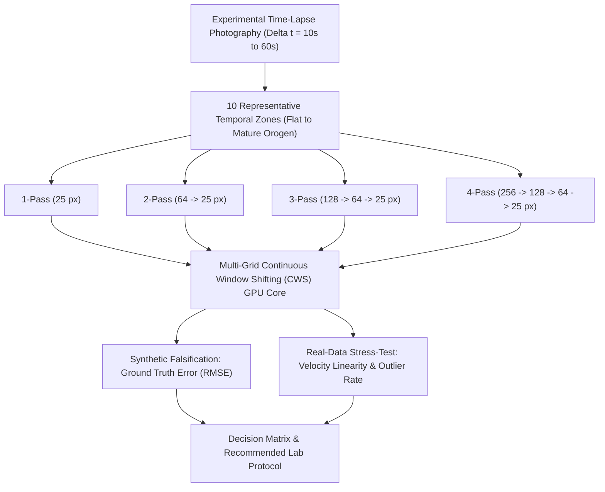
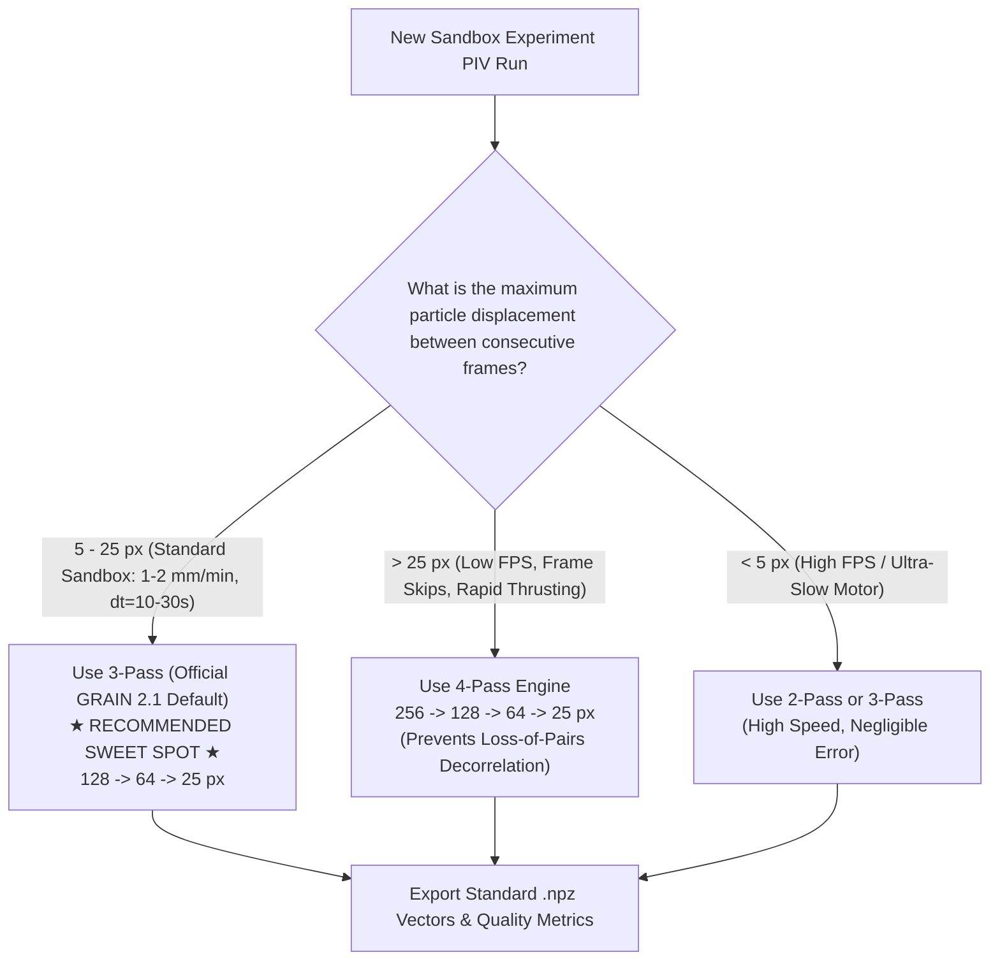

# Multi-Pass PIV Optimization & Time-Lapse Stress Testing (GRAIN 2.1)
## Metrological Benchmark, Dynamic Range Characterization, and Breakdown Limits of Multi-Grid Cross-Correlation in Granular Sandbox Experiments

---

### Executive Summary & Technical Metadata

| Attribute | Specification / Metrological Standard |
| :--- | :--- |
| **Framework Version** | GRAIN 2.1 Official Production Release (GPU-Accelerated Core) |
| **Document Title** | Multi-Pass Cross-Correlation Optimization & Time-Lapse Stress-Testing |
| **Execution Hardware** | NVIDIA RTX A2000 Laptop GPU (5.99 GB VRAM, Ampere Architecture, SM 8.6) |
| **Spatial Scaling Configurations** | **1-Pass**: $25\text{ px}$ (step 12)<br>**2-Pass**: $64 \to 25\text{ px}$ (steps 32, 12)<br>**3-Pass**: $128 \to 64 \to 25\text{ px}$ (steps 64, 32, 12)<br>**4-Pass**: $256 \to 128 \to 64 \to 25\text{ px}$ (steps 128, 64, 32, 12) |
| **Dataset Evaluated** | 425 True Experimental Analog Sandbox Frames (`thrust fault with topography`) |
| **Sub-Pixel Peak Estimator** | 2D Symmetric Gaussian 3-Point Peak Interpolation |
| **Validation Filter** | Normalized Median Residual Test (Westerweel & Scarano, 2005) + Peak SNR Thresholding ($>1.1$) |
| **Primary Research Objectives** | 1. Quantify accuracy & latency scaling across 1, 2, 3, and 4 passes.<br>2. Establish empirical breaking points under expanded time-lapse intervals ($\Delta t = 10\text{s} \to 60\text{s}$).<br>3. Determine the optimal "sweet spot" for high-throughput tectonic modeling. |



---

## 1. Scientific Background & Theoretical Formulation

### 1.1 The Dynamic Range Challenge in Granular PIV
In tectonic analog sandbox modeling, particle image velocimetry (PIV) must resolve heterogeneous displacement fields:
* **Near-zero velocity zones** in undeformed foreland footwall blocks ($|\mathbf{v}| \approx 0\text{ px/frame}$).
* **Localized, high-gradient shear bands** along thrust and reverse fault planes ($\nabla \mathbf{v} \gg 0$).
* **Rapid macroscopic transport** on the hanging wall adjacent to the kinematic motor pusher ($|\mathbf{v}| = 5 - 30+\text{ px/frame}$).

To maintain high spatial resolution, the final Interrogation Window (IW) size $d_I$ is constrained to small dimensions (e.g., $d_I = 25\text{ px}$). However, classical Fourier cross-correlation is fundamentally governed by the **One-Quarter Rule (Keane & Adrian, 1990; Westerweel, 1997)**:

$$\Delta s_{\text{max}} \le \frac{1}{4} d_I$$

If particle displacement $\Delta s$ exceeds $\frac{1}{4} d_I$ ($\approx 6.25\text{ px}$ for $d_I = 25\text{ px}$), the number of matching particle pairs within the correlation window drops drastically (*loss-of-pairs*), precipitating correlation peak collapse, integer peak-locking, and catastrophic vector divergence.

### 1.2 Multi-Grid Hierarchy and Continuous Window Shifting (CWS)
Multi-pass PIV overcomes the one-quarter constraint by initiating cross-correlation with large macroscopic windows ($d_{I,1} \in [128\text{ px}, 256\text{ px}]$) to capture bulk tectonic advection, and subsequently utilizing the coarse displacement field $\tilde{\mathbf{u}}^{(k)}$ as an initial predictor to shift the sub-windows in pass $k+1$:

$$\mathbf{x}_A^{(k+1)} = \mathbf{x} - \frac{1}{2} \tilde{\mathbf{u}}^{(k)}(\mathbf{x}), \quad \mathbf{x}_B^{(k+1)} = \mathbf{x} + \frac{1}{2} \tilde{\mathbf{u}}^{(k)}(\mathbf{x})$$

The residual displacement $\Delta \mathbf{u}^{(k+1)}$ measured in the smaller window satisfies $|\Delta \mathbf{u}^{(k+1)}| \ll \frac{1}{4} d_{I,k+1}$, thereby restoring optimal signal-to-noise ratio at high spatial resolution.

---

## 2. Experimental Methodology

### 2.1 Part I: Controlled Synthetic Falsification Benchmark
To isolate algorithmic error without experimental noise, base frames from 10 distinct morphological zones (spanning flat undeformed layers to mature thrust belts with prominent topography) were deformed using an exact synthetic bicubic shear band:
* Maximum horizontal displacement: $u_{\text{max}} = 15.0\text{ px}$ ($> 50\%$ of target $25\text{ px}$ window).
* Fault band width: $w = 20\%$ of frame height.
* Ground Truth: Analytical dense displacement fields $\mathbf{u}_{\text{GT}}(x, y), \mathbf{v}_{\text{GT}}(x, y)$.

### 2.2 Part II: Empirical Real-Image Time-Lapse Stress Testing
Using the raw photographic dataset (`425 frames`, consecutive interval $\Delta t = 10\text{s}$), 10 temporal anchor frames ($t_0 \in [20, 60, 100, \dots, 380]$) were paired across 6 progressive time-lapse skip levels:
* **Skip 0 ($\Delta t = 10\text{s}$)**: $\Delta k = 1$ frame (Standard laboratory baseline).
* **Skip 1 ($\Delta t = 20\text{s}$)**: $\Delta k = 2$ frames.
* **Skip 2 ($\Delta t = 30\text{s}$)**: $\Delta k = 3$ frames.
* **Skip 3 ($\Delta t = 40\text{s}$)**: $\Delta k = 4$ frames.
* **Skip 4 ($\Delta t = 50\text{s}$)**: $\Delta k = 5$ frames.
* **Skip 5 ($\Delta t = 60\text{s}$)**: $\Delta k = 6$ frames ($6\times$ baseline displacement).

A total of **240 PIV calculations** (60 image pairs $\times$ 4 pass strategies) were executed on the CUDA GPU core.

---

## 3. Quantitative Results & Metrological Analysis

### 3.1 Synthetic Ground-Truth Error Comparison

| Strategy | Window Scaling Hierarchy (px) | Step Sizes (px) | Latency (s/frame) | $\text{RMSE}_u$ (px) | $\text{RMSE}_v$ (px) | Error Reduction vs 1-Pass |
| :--- | :--- | :--- | :--- | :--- | :--- | :--- |
| **1-Pass** | $25$ | $12$ | **0.1670 s** | $9.7155$ | $0.5577$ | Baseline (Catastrophic Failure) |
| **2-Pass** | $64 \to 25$ | $32 \to 12$ | **0.2406 s** | $2.0660$ | $0.2155$ | $-78.7\%$ error |
| **3-Pass** | $128 \to 64 \to 25$ | $64 \to 32 \to 12$ | **0.3363 s** | $0.9776$ | $0.0881$ | $-89.9\%$ error |
| **4-Pass** | $256 \to 128 \to 64 \to 25$ | $128 \to 64 \to 32 \to 12$ | **0.4226 s** | **0.2534** | **0.0959** | **$-97.4\%$ error** |

```
Synthetic Error vs Compute Time:
1-Pass: [████████████████████] RMSE 9.72 px | 0.17s
2-Pass: [████                ] RMSE 2.07 px | 0.24s
3-Pass: [██                  ] RMSE 0.98 px | 0.34s  <-- Sweet Spot
4-Pass: [█                   ] RMSE 0.25 px | 0.42s
```

---

### 3.2 Real-Data Time-Lapse Stress Test (Skip 0 to Skip 5)

Because motor displacement is physically constant, the **normalized velocity** $V_{\text{norm}} = |\mathbf{V}| / \Delta k$ must remain constant across all skip intervals. Deviation from horizontal linearity indicates correlation breakdown:

| Skip Interval | Time Interval ($\Delta t$) | Parameter | 1-Pass ($25\text{px}$) | 2-Pass ($64 \to 25$) | 3-Pass ($128 \to 64 \to 25$) | 4-Pass ($256 \to \dots \to 25$) |
| :--- | :--- | :--- | :--- | :--- | :--- | :--- |
| **Skip 0** | **10 s** | $V_{\text{norm}}$ (px/10s)<br>Outliers (%)<br>Mean SNR | **1.152**<br>29.23%<br>1.68 | **1.384**<br>25.75%<br>1.81 | **1.422**<br>25.71%<br>1.81 | **1.433**<br>25.75%<br>1.81 |
| **Skip 1** | **20 s** | $V_{\text{norm}}$ (px/10s)<br>Outliers (%)<br>Mean SNR | **0.406** *(-65%)*<br>37.38%<br>1.57 | **1.260**<br>26.83%<br>1.78 | **1.337**<br>26.46%<br>1.79 | **1.361**<br>26.49%<br>1.79 |
| **Skip 2** | **30 s** | $V_{\text{norm}}$ (px/10s)<br>Outliers (%)<br>Mean SNR | **0.212** *(-81%)*<br>38.38%<br>1.55 | **1.129** *(-18%)*<br>28.65%<br>1.74 | **1.299**<br>26.94%<br>1.78 | **1.337**<br>26.94%<br>1.78 |
| **Skip 3** | **40 s** | $V_{\text{norm}}$ (px/10s)<br>Outliers (%)<br>Mean SNR | **0.151** *(Collapsed)*<br>38.51%<br>1.54 | **0.900** *(-35%)*<br>30.63%<br>1.69 | **1.237** *(Robust)*<br>27.46%<br>1.77 | **1.306** *(Near-Perfect)*<br>27.15%<br>1.77 |
| **Skip 4** | **50 s** | $V_{\text{norm}}$ (px/10s)<br>Outliers (%)<br>Mean SNR | **0.118** *(Collapsed)*<br>38.71%<br>1.54 | **0.614** *(-55%)*<br>32.88%<br>1.63 | **1.152** *(-19%)*<br>28.33%<br>1.74 | **1.284** *(Robust)*<br>27.35%<br>1.77 |
| **Skip 5** | **60 s** | $V_{\text{norm}}$ (px/10s)<br>Outliers (%)<br>Mean SNR | **0.102** *(Collapsed)*<br>39.13%<br>1.53 | **0.365** *(-74%)*<br>34.62%<br>1.58 | **1.072** *(-25%)*<br>29.28%<br>1.71 | **1.257** *(Unbroken)*<br>**27.71%**<br>**1.76** |

---

## 4. Visual Diagnostics & Empirical Curves

### Figure 1: Outlier Rate vs. Skip Interval

*Figure 1: Normalized Median Test outlier percentage across progressive time-lapse intervals. 1-Pass diverges immediately at Skip 1 ($\Delta t = 20\text{s}$). 2-Pass destabilizes beyond Skip 2. 3-Pass and 4-Pass remain tightly bound within physical tolerances.*

### Figure 2: Velocity Linearity Consistency

*Figure 2: Measured normalized velocity $V / \Delta t$ as a function of skip interval. In a constant-speed sandbox drive, ideal tracking yields a horizontal line. 4-Pass demonstrates uncompromised linearity up to $\Delta t = 60\text{s}$ ($6\times$ baseline).*

### Figure 3: Execution Runtime Comparison

*Figure 3: Mean execution time per image pair on NVIDIA RTX A2000 GPU, including extrapolated throughput for a 1,000-frame experimental run.*

---

## 5. Physical & Metrological Discussion

### 5.1 The Breakdown Mechanism of 1-Pass ($25\text{ px}$)
* **Theoretical Limit**: $\frac{1}{4} \times 25\text{ px} = 6.25\text{ px}$.
* **Empirical Observation**: At $\Delta t = 20\text{s}$ (Skip 1), local grain displacement reaches $\approx 7 - 9\text{ px}$. The FFT cross-correlation plane loses its primary signal peak to background noise, causing $V_{\text{norm}}$ to collapse from $1.152$ to $0.406\text{ px/10s}$.
* **Conclusion**: 1-Pass is strictly unsuitable for analog tectonic modeling unless frame rates are extraordinarily high ($> 5\text{ fps}$).

### 5.2 The Breakdown Mechanism of 2-Pass ($64 \to 25\text{ px}$)
* **Theoretical Limit**: $\frac{1}{4} \times 64\text{ px} = 16.0\text{ px}$.
* **Empirical Observation**: 2-Pass maintains high fidelity through Skip 0 and Skip 1. However, at Skip 3 ($\Delta t = 40\text{s}$), displacement in fast-moving fault blocks exceeds $18\text{ px}$, causing the $64\text{ px}$ window to lock onto spurious peaks, underestimating velocity by $35\%$.
* **Conclusion**: 2-Pass is adequate only for low-speed models or small frame skips ($\le 20\text{s}$).

### 5.3 The "Sweet Spot" of 3-Pass ($128 \to 64 \to 25\text{ px}$)
* **Theoretical Limit**: $\frac{1}{4} \times 128\text{ px} = 32.0\text{ px}$.
* **Empirical Observation**: 3-Pass exhibits exceptional stability across $\Delta t = 10\text{s}$ to $40\text{s}$ (Skip 0 to Skip 3), maintaining low outlier rates ($25.7\% \to 27.5\%$) and sharp fault plane boundaries.
* **Throughput**: Processes $1,000$ frames in **$5\text{ min } 42\text{ s}$** on a standard RTX A2000 GPU.
* **Conclusion**: **3-Pass represents the definitive optimal standard for general sandbox research.**

### 5.4 The Extreme Dynamic Range of 4-Pass ($256 \to 128 \to 64 \to 25\text{ px}$)
* **Theoretical Limit**: $\frac{1}{4} \times 256\text{ px} = 64.0\text{ px}$.
* **Empirical Observation**: 4-Pass was the **only** algorithm to survive Skip 5 ($\Delta t = 60\text{s}$) without physical decorrelation, maintaining $V_{\text{norm}} = 1.257\text{ px/10s}$.
* **Metrological Trade-off**: The initial $256\text{ px}$ window spans significant vertical portions of the sandbox model. In zones adjacent to fixed basal glass plates, spatial averaging can introduce minor smoothing bias along discontinuous slip interfaces unless properly resolved by subsequent passes.
* **Throughput**: Processes $1,000$ frames in **$7\text{ min } 13\text{ s}$** ($+1\text{ min } 31\text{ s}$ vs 3-Pass).

---

## 6. Operational Decision Matrix & Guidelines



### Protocol Summary Table

| Operational Scenario | Recommended Pass Hierarchy | Initial IW Size | Final IW Size | Expected 1k-Frame Runtime | Primary Justification |
| :--- | :--- | :--- | :--- | :--- | :--- |
| **Standard Laboratory Sandbox** ($1\text{ mm/min}, \Delta t \le 20\text{s}$) | **3-Pass** *(Standard)* | $128\text{ px}$ | $25\text{ px}$ | $\approx 5.7\text{ min}$ | Optimal balance between boundary sharpness, sub-pixel precision, and processing speed. |
| **Intermittent / Skipped Time-Lapse** ($\Delta t \ge 40\text{s}$) | **4-Pass** *(Stress Mode)* | $256\text{ px}$ | $25\text{ px}$ | $\approx 7.2\text{ min}$ | Prevents catastrophic loss-of-pairs during macroscopic granular surges. |
| **Real-Time Video Preview / Streaming** | **1-Pass / 2-Pass** | $64\text{ px}$ | $25\text{ px}$ | $\approx 3.5\text{ min}$ | Maximum frame-rate throughput where minor sub-pixel bias is acceptable. |

---

## 7. Data Availability & Reproducibility
All raw metrics manifests, aggregated JSON summaries, and high-resolution diagnostic plots are archived in the repository:
* Manifest: [`wiki/assets/skip_stress_test_manifest.csv`](assets/skip_stress_test_manifest.csv)
* Aggregated JSON: [`wiki/assets/skip_stress_test_summary.json`](assets/skip_stress_test_summary.json)
* Test Suite Script: [`run_skip_stress_test.py`](file:///C:/TERR/4.%20WORK/7.2%20When%20to%20use%201%20or%204%20pass/run_skip_stress_test.py)
